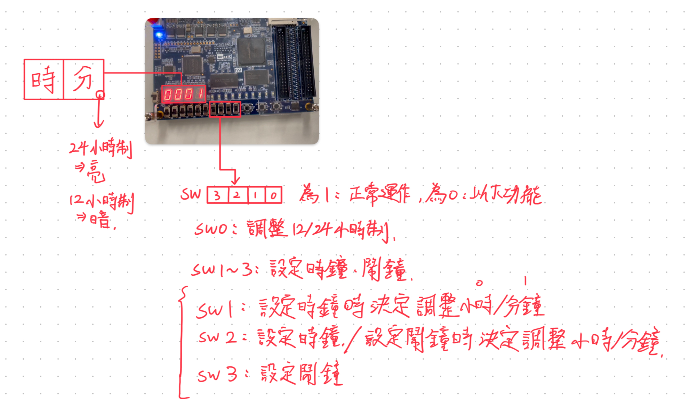

# 數位系統設計期末專案

## 選擇的題目:

第一題，時鐘(包含設定時間、12/24 小時制切換、鬧鐘功能)

## 實現的功能:



### VHDL 程式碼

#### 專案結構:

```
alarm_clock.vhd
├─── hms_to_digits.vhd -> 將時、分轉換成4個數字
├─── alarm.vhd -> 鬧鐘功能
├─── decoder_7seg.vhd -> 七段顯示器解碼器
├─── speaker.vhd -> 鬧鐘響的功能，目前以點亮所有LED實現
└─── clock_12_24.vhd -> 12/24小時制轉換
```

#### alarm_clock.vhd:

```vhdl
-- combine the two previous examples
LIBRARY IEEE;
USE IEEE.STD_LOGIC_1164.ALL;
USE IEEE.STD_LOGIC_ARITH.ALL;
USE IEEE.STD_LOGIC_UNSIGNED.ALL;

ENTITY alarm_clock IS
    PORT (
        clk : IN STD_LOGIC;
        reset : IN STD_LOGIC;
        SW : IN STD_LOGIC; -- 0 = 12 hour mode, 1 = 24 hour mode
        SW1 : IN STD_LOGIC; -- 0 = set time, 1 = normal operation
        SW2 : IN STD_LOGIC; -- 0 = set hour, 1 = set minute
        SW3 : IN STD_LOGIC; -- 0 = set alarm, 1 = normal operation
        btn : IN STD_LOGIC; -- increment time
        seg0 : OUT STD_LOGIC_VECTOR(6 DOWNTO 0);
        seg1 : OUT STD_LOGIC_VECTOR(6 DOWNTO 0);
        seg2 : OUT STD_LOGIC_VECTOR(6 DOWNTO 0);
        seg3 : OUT STD_LOGIC_VECTOR(6 DOWNTO 0);
        --alarmo : OUT STD_LOGIC;
        LED : OUT STD_LOGIC_VECTOR(9 DOWNTO 0);
        dot : OUT STD_LOGIC; -- if 12 hour mode, dot = 0, else dot = 1
        --h : INTEGER RANGE 0 TO 23 := 0; -- hours
        --m : INTEGER RANGE 0 TO 59 := 0 -- minutes
        hour : OUT INTEGER RANGE 0 TO 23;
        minute : OUT INTEGER RANGE 0 TO 59;
        ddde : OUT STD_LOGIC;
        dddde : OUT STD_LOGIC
    );
END alarm_clock;

ARCHITECTURE Behavioral OF alarm_clock IS
    --original clk:50MHz, clock : 1Hz
    SIGNAL clk_div : STD_LOGIC_VECTOR(23 DOWNTO 0) := "100110001001011010000000"; -- 50_000_000
    --SIGNAL clk_div : STD_LOGIC_VECTOR(19 DOWNTO 0) := "11001011011100110101"; -- 50_000_000
    SIGNAL clk_cnt : STD_LOGIC_VECTOR(24 DOWNTO 0); --generate 1Hz clock
    SIGNAL clk_1Hz : STD_LOGIC := '0';
    SIGNAL alarm_h : INTEGER RANGE 0 TO 23 := 0; -- alarm hours
    SIGNAL alarm_m : INTEGER RANGE 0 TO 59 := 0; -- alarm minutes
    SIGNAL h : INTEGER RANGE 0 TO 23 := 0; -- hours
    SIGNAL m : INTEGER RANGE 0 TO 59 := 0; -- minutes
    SIGNAL sec : INTEGER RANGE 0 TO 59 := 0; -- seconds
    SIGNAL digit0_24 : INTEGER RANGE 0 TO 9;
    SIGNAL digit1_24 : INTEGER RANGE 0 TO 9;
    SIGNAL digit2_24 : INTEGER RANGE 0 TO 9;
    SIGNAL digit3_24 : INTEGER RANGE 0 TO 9;
    SIGNAL digit0_12 : INTEGER RANGE 0 TO 9;
    SIGNAL digit1_12 : INTEGER RANGE 0 TO 9;
    SIGNAL digit2_12 : INTEGER RANGE 0 TO 9;
    SIGNAL digit3_12 : INTEGER RANGE 0 TO 9;
    SIGNAL h12 : INTEGER RANGE 0 TO 12;
    SIGNAL digit0_alarm : INTEGER RANGE 0 TO 9;
    SIGNAL digit1_alarm : INTEGER RANGE 0 TO 9;
    SIGNAL digit2_alarm : INTEGER RANGE 0 TO 5;
    SIGNAL digit3_alarm : INTEGER RANGE 0 TO 9;
    SIGNAL segt0_24 : STD_LOGIC_VECTOR(6 DOWNTO 0);
    SIGNAL segt1_24 : STD_LOGIC_VECTOR(6 DOWNTO 0);
    SIGNAL segt2_24 : STD_LOGIC_VECTOR(6 DOWNTO 0);
    SIGNAL segt3_24 : STD_LOGIC_VECTOR(6 DOWNTO 0);
    SIGNAL segt0_12 : STD_LOGIC_VECTOR(6 DOWNTO 0);
    SIGNAL segt1_12 : STD_LOGIC_VECTOR(6 DOWNTO 0);
    SIGNAL segt2_12 : STD_LOGIC_VECTOR(6 DOWNTO 0);
    SIGNAL segt3_12 : STD_LOGIC_VECTOR(6 DOWNTO 0);
    SIGNAL segt0_alarm : STD_LOGIC_VECTOR(6 DOWNTO 0);
    SIGNAL segt1_alarm : STD_LOGIC_VECTOR(6 DOWNTO 0);
    SIGNAL segt2_alarm : STD_LOGIC_VECTOR(6 DOWNTO 0);
    SIGNAL segt3_alarm : STD_LOGIC_VECTOR(6 DOWNTO 0);
    SIGNAL alarmo : STD_LOGIC := '0';

    COMPONENT hms_to_digits
        PORT (
            h : IN INTEGER RANGE 0 TO 23;
            m : IN INTEGER RANGE 0 TO 59;
            digit0 : OUT INTEGER RANGE 0 TO 9;
            digit1 : OUT INTEGER RANGE 0 TO 9;
            digit2 : OUT INTEGER RANGE 0 TO 5;
            digit3 : OUT INTEGER RANGE 0 TO 9
        );
    END COMPONENT;

    COMPONENT clock_12_24
        PORT (
            h : IN INTEGER RANGE 0 TO 23;
            m : IN INTEGER RANGE 0 TO 59;
            h12 : OUT INTEGER RANGE 0 TO 12
        );
    END COMPONENT;

    COMPONENT alarm
        PORT (
            now_digit0 : IN INTEGER RANGE 0 TO 9;
            now_digit1 : IN INTEGER RANGE 0 TO 9;
            now_digit2 : IN INTEGER RANGE 0 TO 5;
            now_digit3 : IN INTEGER RANGE 0 TO 9;
            alarm_digit0 : IN INTEGER RANGE 0 TO 9;
            alarm_digit1 : IN INTEGER RANGE 0 TO 9;
            alarm_digit2 : IN INTEGER RANGE 0 TO 5;
            alarm_digit3 : IN INTEGER RANGE 0 TO 9;
            alarmo : OUT STD_LOGIC
        );
    END COMPONENT;

    COMPONENT decoder_7seg
        PORT (
            BCD : IN INTEGER RANGE 0 TO 9;
            HEX : OUT STD_LOGIC_VECTOR(6 DOWNTO 0)
        );
    END COMPONENT;

    COMPONENT speaker
        PORT (
            alarmo : IN STD_LOGIC;
            led : OUT STD_LOGIC_VECTOR(9 DOWNTO 0)
        );
    END COMPONENT;

BEGIN
    ddde <= '1';
    dddde <= '1';
    PROCESS (clk, reset)
    BEGIN
        IF reset = '0' THEN
            clk_cnt <= (OTHERS => '0');
        ELSIF clk'EVENT AND clk = '1' THEN
            IF clk_cnt = clk_div THEN
                clk_cnt <= (OTHERS => '0');
            ELSE
                clk_cnt <= clk_cnt + 1;
            END IF;
        END IF;
    END PROCESS;
    clk_1Hz <= clk_cnt(23); -- 1Hz clock

    PROCESS (clk_1Hz, reset)
    BEGIN
        IF reset = '0' THEN
            h <= 0;
            m <= 0;
            sec <= 0;
            alarm_h <= 0;
            alarm_m <= 0;
        ELSIF clk_1Hz'EVENT AND clk_1Hz = '1' THEN
            IF SW3 = '0' THEN -- set alarm
                IF SW2 = '0' THEN -- set alarm hour
                    IF btn = '0' THEN -- increment alarm hour
                        IF alarm_h = 23 THEN
                            alarm_h <= 0;
                        ELSE
                            alarm_h <= alarm_h + 1;
                        END IF;
                    END IF;
                ELSE -- set alarm minute
                    IF btn = '0' THEN -- increment alarm minute
                        IF alarm_m = 59 THEN
                            alarm_m <= 0;
                        ELSE
                            alarm_m <= alarm_m + 1;
                        END IF;
                    END IF;
                END IF;
            ELSIF SW2 = '0' THEN -- set time
                IF SW1 = '0' THEN -- set hour
                    IF btn = '0' THEN -- increment hour
                        IF h = 23 THEN
                            h <= 0;
                        ELSE
                            h <= h + 1;
                        END IF;
                    END IF;
                ELSE -- set minute
                    IF btn = '0' THEN -- increment minute
                        IF m = 59 THEN
                            m <= 0;
                        ELSE
                            m <= m + 1;
                        END IF;
                    END IF;
                END IF;
            ELSE -- normal operation
                IF sec = 59 THEN
                    sec <= 0;
                    IF m = 59 THEN
                        m <= 0;
                        IF h = 23 THEN
                            h <= 0;
                        ELSE
                            h <= h + 1;
                        END IF;
                    ELSE
                        m <= m + 1;
                    END IF;
                ELSE
                    sec <= sec + 1;
                END IF;
            END IF;
        END IF;
    END PROCESS;

    hms_to_digits_24 : hms_to_digits PORT MAP(h, m, digit0_24, digit1_24, digit2_24, digit3_24);
    clock_12_24_inst : clock_12_24 PORT MAP(h, m, h12);
    hms_to_digits_12 : hms_to_digits PORT MAP(h12, m, digit0_12, digit1_12, digit2_12, digit3_12);
    hms_to_digits_alarm : hms_to_digits PORT MAP(alarm_h, alarm_m, digit0_alarm, digit1_alarm, digit2_alarm, digit3_alarm);
    alarm_inst : alarm PORT MAP(digit0_24, digit1_24, digit2_24, digit3_24, digit0_alarm, digit1_alarm, digit2_alarm, digit3_alarm, alarmo);

    seven_seg_0 : decoder_7seg PORT MAP(digit0_24, segt0_24);
    seven_seg_1 : decoder_7seg PORT MAP(digit1_24, segt1_24);
    seven_seg_2 : decoder_7seg PORT MAP(digit2_24, segt2_24);
    seven_seg_3 : decoder_7seg PORT MAP(digit3_24, segt3_24);
    seven_seg_4 : decoder_7seg PORT MAP(digit0_12, segt0_12);
    seven_seg_5 : decoder_7seg PORT MAP(digit1_12, segt1_12);
    seven_seg_6 : decoder_7seg PORT MAP(digit2_12, segt2_12);
    seven_seg_7 : decoder_7seg PORT MAP(digit3_12, segt3_12);
    seven_seg_8 : decoder_7seg PORT MAP(digit0_alarm, segt0_alarm);
    seven_seg_9 : decoder_7seg PORT MAP(digit1_alarm, segt1_alarm);
    seven_seg_10 : decoder_7seg PORT MAP(digit2_alarm, segt2_alarm);
    seven_seg_11 : decoder_7seg PORT MAP(digit3_alarm, segt3_alarm);
    speaker0 : speaker PORT MAP(alarmo, LED);
    seg0 <= segt0_alarm WHEN SW3 = '0' ELSE
        segt0_24 WHEN SW = '0' ELSE
        segt0_12 WHEN SW = '1';
    seg1 <= segt1_alarm WHEN SW3 = '0' ELSE
        segt1_24 WHEN SW = '0' ELSE
        segt1_12 WHEN SW = '1';
    seg2 <= segt2_alarm WHEN SW3 = '0' ELSE
        segt2_24 WHEN SW = '0' ELSE
        segt2_12 WHEN SW = '1';
    seg3 <= segt3_alarm WHEN SW3 = '0' ELSE
        segt3_24 WHEN SW = '0' ELSE
        segt3_12 WHEN SW = '1';

    dot <= '0' WHEN SW = '0' ELSE
        '1';
    hour <= h;
    minute <= m;
END Behavioral;
```

#### hms_to_digits.vhd:

```vhdl
-- h m to 4 digits
-- 4 digits are 0-2, 0-3, 0-5, 0-9

LIBRARY IEEE;
USE ieee.std_logic_1164.ALL;
USE ieee.std_logic_unsigned.ALL;
USE ieee.std_logic_arith.ALL;

ENTITY hms_to_digits IS
    PORT (
        h : IN INTEGER RANGE 0 TO 23;
        m : IN INTEGER RANGE 0 TO 59;
        digit0 : OUT INTEGER RANGE 0 TO 9;
        digit1 : OUT INTEGER RANGE 0 TO 9;
        digit2 : OUT INTEGER RANGE 0 TO 5;
        digit3 : OUT INTEGER RANGE 0 TO 9
    );
END hms_to_digits;

-- consume h = 23, m = 59 -> 2 3 5 9
ARCHITECTURE Behavioral OF hms_to_digits IS
BEGIN
    digit0 <= h / 10; -- 2
    digit1 <= h MOD 10; -- 3
    digit2 <= m / 10; -- 5
    digit3 <= m MOD 10; -- 9
END Behavioral;
```

#### alarm.vhd:

```vhdl
-- an alarm, takes current from clock and sets off an alarm when the time matches

LIBRARY IEEE;
USE IEEE.STD_LOGIC_1164.ALL;
USE IEEE.STD_LOGIC_ARITH.ALL;
USE IEEE.STD_LOGIC_UNSIGNED.ALL;

ENTITY alarm IS
    PORT (
        now_digit0 : IN INTEGER RANGE 0 TO 9;
        now_digit1 : IN INTEGER RANGE 0 TO 9;
        now_digit2 : IN INTEGER RANGE 0 TO 5;
        now_digit3 : IN INTEGER RANGE 0 TO 9;
        alarm_digit0 : IN INTEGER RANGE 0 TO 9;
        alarm_digit1 : IN INTEGER RANGE 0 TO 9;
        alarm_digit2 : IN INTEGER RANGE 0 TO 5;
        alarm_digit3 : IN INTEGER RANGE 0 TO 9;
        alarmo : OUT STD_LOGIC
    );

END alarm;

ARCHITECTURE Behavioral OF alarm IS
BEGIN
    alarmo <= '1' WHEN now_digit0 = alarm_digit0 AND now_digit1 = alarm_digit1 AND now_digit2 = alarm_digit2 AND now_digit3 = alarm_digit3 ELSE
        '0';
END Behavioral;
```

#### decoder_7seg.vhd:

```vhdl
-- decoder for 7-segment display
LIBRARY ieee;
USE ieee.std_logic_1164.ALL;
USE ieee.std_logic_unsigned.ALL;

ENTITY decoder_7seg IS
    PORT (
        --BCD : IN STD_LOGIC_VECTOR(3 DOWNTO 0);
        BCD : IN INTEGER RANGE 0 TO 9;
        HEX : OUT STD_LOGIC_VECTOR(6 DOWNTO 0)
    );
END decoder_7seg;

ARCHITECTURE decoder_7seg OF decoder_7seg IS
BEGIN

    HEX <= "1000000" WHEN BCD = 0 ELSE
        "1111001" WHEN BCD = 1 ELSE
        "0100100" WHEN BCD = 2 ELSE
        "0110000" WHEN BCD = 3 ELSE
        "0011001" WHEN BCD = 4 ELSE
        "0010010" WHEN BCD = 5 ELSE
        "0000010" WHEN BCD = 6 ELSE
        "1111000" WHEN BCD = 7 ELSE
        "0000000" WHEN BCD = 8 ELSE
        "0010000" WHEN BCD = 9 ELSE
        "1111111";
END decoder_7seg;
```

#### speaker.vhd:

```vhdl
library ieee;
USE IEEE.STD_LOGIC_1164.ALL;
USE IEEE.STD_LOGIC_ARITH.ALL;
USE IEEE.STD_LOGIC_UNSIGNED.ALL;

ENTITY speaker IS
    PORT (
        alarmo : IN STD_LOGIC;
		  led : OUT STD_LOGIC_VECTOR(9 downto 0)
	 );
END speaker;

ARCHITECTURE Behavioral OF speaker IS
BEGIN
    led <= "1111111111" when alarmo = '1' else
	     "0000000000";
END Behavioral;

```

#### clock_12_24.vhd:

```vhdl
-- component use to convert 24 hour time to 12 hour time

LIBRARY IEEE;
USE IEEE.STD_LOGIC_1164.ALL;
USE IEEE.STD_LOGIC_ARITH.ALL;
USE IEEE.STD_LOGIC_UNSIGNED.ALL;

ENTITY clock_12_24 IS
    PORT (
        h : IN INTEGER RANGE 0 TO 23;
        m : IN INTEGER RANGE 0 TO 59;
        h12 : OUT INTEGER RANGE 0 TO 12
    );
END clock_12_24;

ARCHITECTURE Behavioral OF clock_12_24 IS
BEGIN
    h12 <= h - 12 WHEN h > 12 ELSE
        h;
END Behavioral;
```

## 心得:

這個期末專案的題目不難，所以我想盡量讓功能完整一點，
除了在鬧鐘和設定時間上有遇到 bug 之外都還算上手，
這門課算是本學期數一數二讓我感到困難的，但是我卻獲得了滿滿的成就感。
謝謝老師和助教這學期的教學和幫助!
